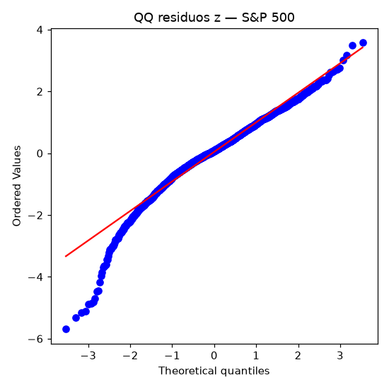
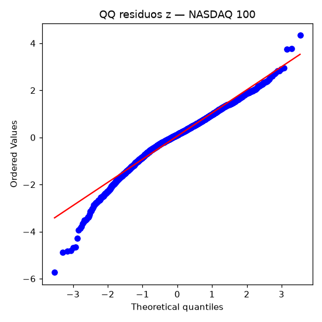
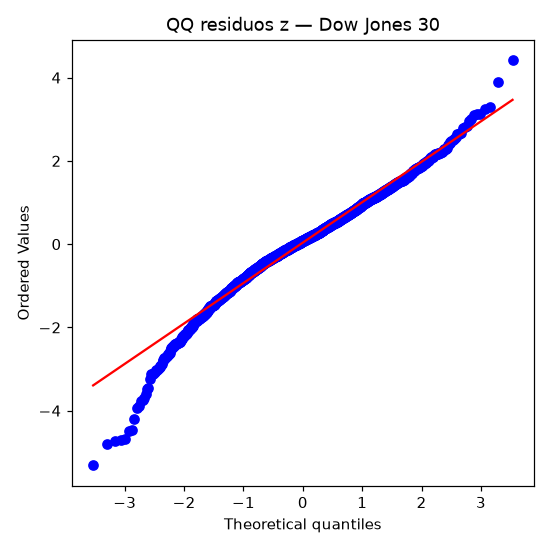
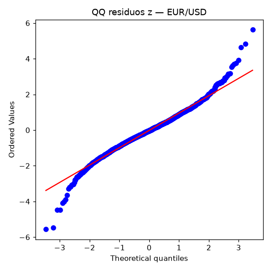
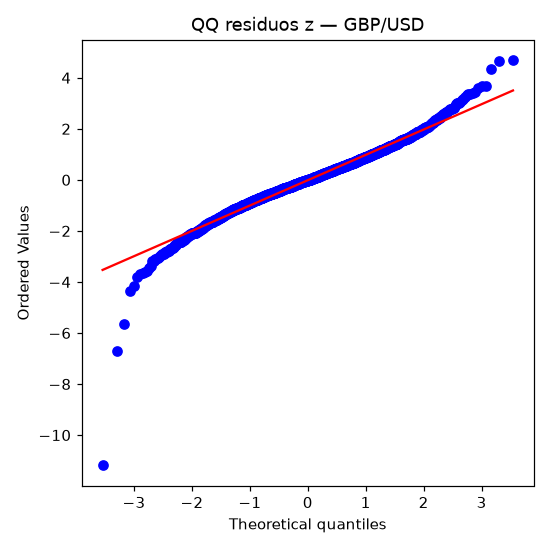
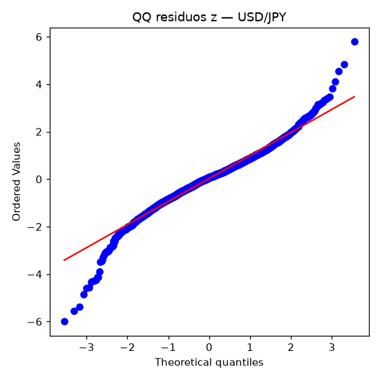
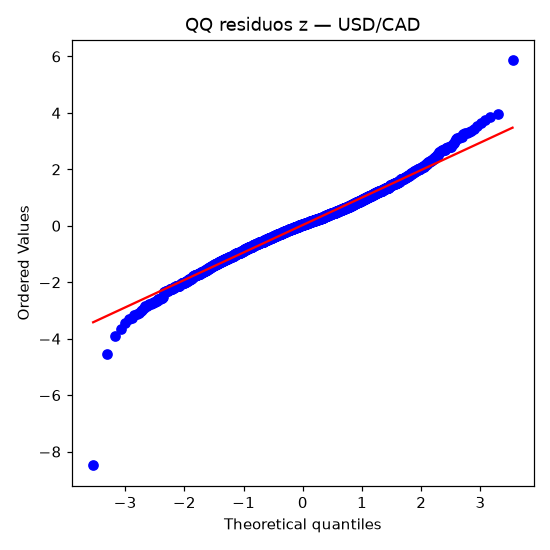

# Backtest walk-forward — 2026-09-24 15:50 UTC

Bloques TimeSeriesSplit: 4. Historia intradía: 60d. Historia diaria desde: 2010-01-01.

## Detector de anomalías (walk-forward purgado, velas de 5 min)

Positivo = hubo reversión en las siguientes barras. Baseline = marcar anomalías al azar con la misma tasa que el modelo.

| Activo | n | Anomalías | TN / FP / FN / TP | Precisión [IC95] | Recall | F1 | Precisión base | F1 base | ¿Supera? |
|---|---|---|---|---|---|---|---|---|---|
| S&P 500 | 3612 | 168 | 1705 / 82 / 1739 / 86 | 0.512 [0.437, 0.586] | 0.047 | 0.086 | 0.573 | 0.091 | no |
| NASDAQ 100 | 3616 | 181 | 1732 / 81 / 1703 / 100 | 0.552 [0.480, 0.623] | 0.055 | 0.101 | 0.488 | 0.085 | sí |
| Dow Jones 30 | 3616 | 154 | 1695 / 78 / 1767 / 76 | 0.494 [0.416, 0.572] | 0.041 | 0.076 | 0.525 | 0.074 | sí |
| EUR/USD | 13532 | 607 | 3763 / 269 / 9162 / 338 | 0.557 [0.517, 0.596] | 0.036 | 0.067 | 0.697 | 0.085 | no |
| GBP/USD | 13532 | 617 | 5947 / 276 / 6968 / 341 | 0.553 [0.513, 0.591] | 0.047 | 0.086 | 0.560 | 0.087 | no |
| USD/JPY | 13476 | 601 | 6221 / 290 / 6654 / 311 | 0.517 [0.478, 0.557] | 0.045 | 0.082 | 0.515 | 0.081 | sí |
| USD/CAD | 13484 | 628 | 5742 / 225 / 7114 / 403 | 0.642 [0.603, 0.678] | 0.054 | 0.099 | 0.540 | 0.083 | sí |
| **Promedio (macro)** | | | | | | **0.085** | | **0.084** | |

## Volatilidad GARCH(1,1)-t (walk-forward, pronóstico a 1 día)

QLIKE: menor es mejor. Baseline = desviación estándar de los últimos días (ventana móvil, sin incluir el día pronosticado). E[z²] cercano a 1 indica varianza bien calibrada; p(LB z²) > 0.05 indica que no quedan efectos ARCH sin modelar.

| Activo | n | QLIKE | QLIKE base | RMSE | RMSE base | E[z²] | p(JB) | p(LB z²) | ¿Supera? |
|---|---|---|---|---|---|---|---|---|---|
| S&P 500 | 3364 | 0.6868 | 0.8360 | 0.7486 | 0.7831 | 0.945 | 0.000 | 0.288 | sí |
| NASDAQ 100 | 3364 | 1.2442 | 1.3657 | 0.9277 | 0.9605 | 0.994 | 0.000 | 0.239 | sí |
| Dow Jones 30 | 3364 | 0.6023 | 0.7347 | 0.7257 | 0.7686 | 0.964 | 0.000 | 0.131 | sí |
| EUR/USD | 2610 | -0.4967 | -0.4305 | 0.3582 | 0.3606 | 0.964 | 0.000 | 0.064 | sí |
| GBP/USD | 3480 | -0.3096 | -0.2588 | 0.4047 | 0.4122 | 1.018 | 0.000 | 0.041 | sí |
| USD/JPY | 3480 | -0.2677 | -0.1944 | 0.4084 | 0.4092 | 0.970 | 0.000 | 0.665 | sí |
| USD/CAD | 3480 | -0.7430 | -0.6872 | 0.3108 | 0.3121 | 0.965 | 0.000 | 0.000 | sí |

## QQ-plots de residuos estandarizados (GARCH)

## Errores

- Ninguno.
